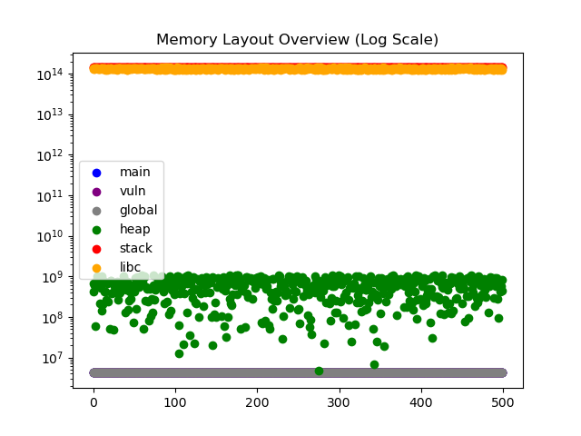
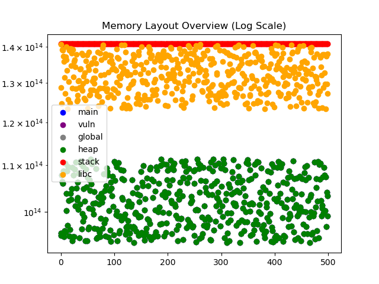
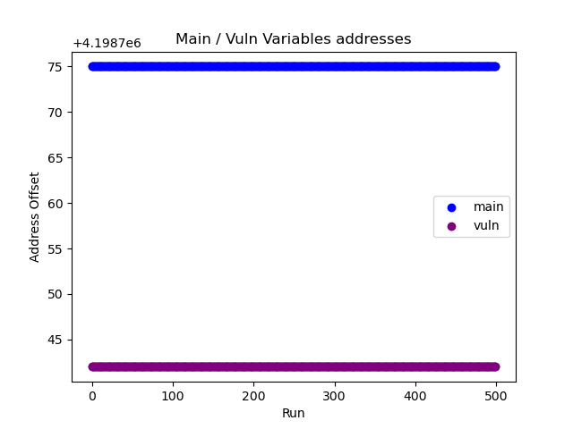
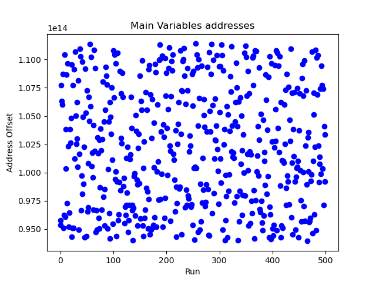
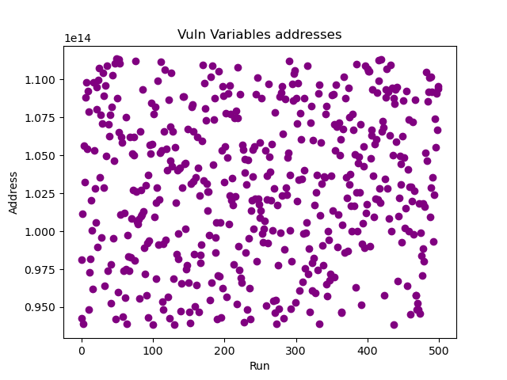
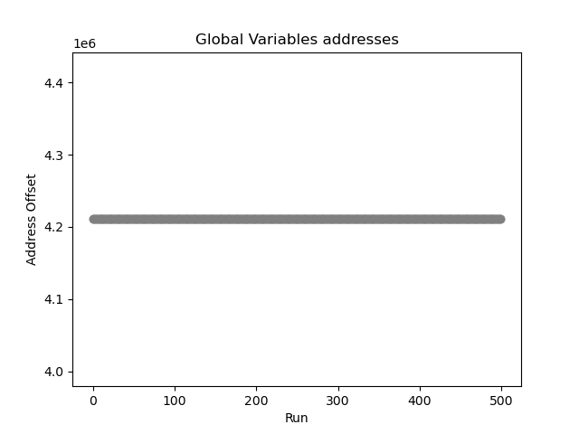
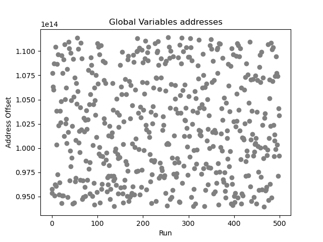

# How Does PIE Change Memory Randomization?

## 1. Introduction
[Last time](https://github.com/mio-mio/aslr), I examined ASLR without PIE and observed how memory addresses behave.

In this experiment, I explore how enabling PIE changes the memory addresses' behavior.

Does PIE increase randomness of the executable itself, or does it only shift addresses together?

This experiment aims to observe how PIE affects address randomization, and to measure how much entropy is actually introduced.

## 2. What PIE Actually Does

PIE is typically used together with ASLR, as it allows the program itself to be loaded at different base addresses, enabling full randomization of the executable.

Without PIE, the executable is loaded at a fixed base address, even when ASLR is enabled as far as I tested in [last experiment](https://github.com/mio-mio/aslr).

## 3. Experiment Setup

To observe the effect of PIE, I compiled the vulnerable C program with and without PIE, and compared the results under ASLR.

I repeatedly executed the program and recorded the addresses to compare how it changes across runs.

In this experiment, I inculded vuln() in the C program and also observed the address of vuln() to see whether individual functions are randomized independently or move together with the executable base address.

## 4. Observations: What Changes between No-PIE and PIE

  
  

This time, I observed six regions: main, vuln, global, heap, stack, and libc under both configurations: without PIE (left) and with PIE (right).

Some regions are difficult to distinguish in the overview graphs because certain addresses overlap visually, while others appear compressed due to the large differences in address ranges.

However, the distributions of libc (orange), heap (green), and the executable-related regions appear noticeably different at first glance.

Another important point is the y-axis scale. In the non-PIE experiment, the addresses ranged roughly from (10^7) to (10^{14}). In contrast, under PIE, most observed regions appeared within a much narrower and higher address range around (10^{14}).

This suggests that enabling PIE significantly changes the placement behavior of the executable-related regions in memory.

To better understanding how each region behavior, I examined individually in the following sections.

## 4.1 Main & Vuln

  
  
  

These three graphs show the behavior of main and vuln without PIE (left), main with PIE (center), and vuln with PIE (right).

Without PIE, both addresses remain fixed across executions. In contrast, enabling PIE causes both addresses to change on every run.

Interestingly, the distributions of main and vuln under PIE appear visually very similar, suggesting that both functions move together with the executable base address.

## 4.2 Global Variables

  
  

Global variable distributions without PIE (left) and with PIE (right).

The global variable region could not be clearly distinguished when observing all six regions together in the overview graph. However, individual analysis revealed that the global variables are also randomized under PIE.

Interestingly, the distribution of global variables under PIE appears visually very similar to the distributions of main and vuln under PIE (see Section 4.1), suggesting that the global variables also move together with the executable base address.

## 4.3 Heap
## 4.4 Stack
## 4.5 Libc
## 4.6 Cross-Region Comparison 
